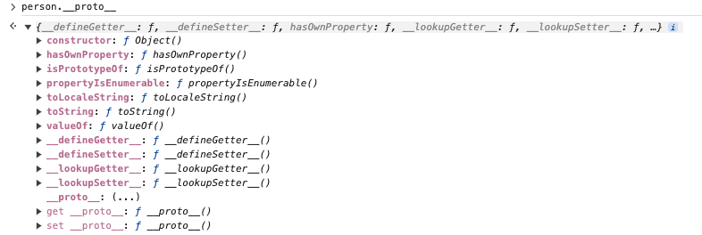

# 서론

- 자바스크립트는 무슨 프로그래밍 언어일까?
  - 명령형?
  - 함수형?
  - 프로토타입 기반?
  - 객체지향?
- 자바스크립트는 위에 나열된 프로그래밍 기법이 모두 사용 가능하다.
  
- 자바스크립트에서는 원시 값을 제외한 모든 프로그래밍 요소들이 `객체`이다.
  - 함수
  - 배열
  - 정규 표현식
* 원시 값들도 각각의 API 들을 통해 객체처럼 사용할 수 있다. [String](https://developer.mozilla.org/en-US/docs/Web/JavaScript/Reference/Global_Objects/String), [Number](https://developer.mozilla.org/en-US/docs/Web/JavaScript/Reference/Global_Objects/Number), [Boolean](https://developer.mozilla.org/en-US/docs/Web/JavaScript/Reference/Global_Objects/Boolean), [BigInt](https://developer.mozilla.org/en-US/docs/Web/JavaScript/Reference/Global_Objects/BigInt), [Symbol](https://developer.mozilla.org/en-US/docs/Web/JavaScript/Reference/Global_Objects/Symbol). (undefined, null은 API가 없음)

# 객체지향 프로그래밍

- 객체지향 프로그래밍은 여러 개의 독립적인 단위인 객체의 집합으로 프로그램을 표현하는 것이다.
- 객체지향 프로그래밍에서는 실제 사물이나 개념을 코드로 표현하려고 했던 시도에서부터 시작했다.
예)
```javascript
const person = {
  name: "Lee",
  address: "Seoul"
}
```

- 위 코드에서 정의된 사람의 이름은 `Lee`, 주소는 `Seoul` 인데, 이 두가지 특성을 **속성, (attribute 혹은 property)** 라고 하고, 이 속성을 통해 객체를 구별할 수 있다.
- 사실 이 사람은 `Lee`, `Seoul` 이라는 특성 외에도 키가 `180cm` 라던지, 취미가 `Eating Popcorns in CGV` 라던지 여러가지 특성이 있을텐데, 여기서는 `name` 과 `address` 만 저장하였다.
  - 이처럼 필요한 속성만 간추려서 표현하는 것을 `추상화` 라고 한다.

- 다음은 `Circle` 을 객체로 만든 코드이다.

```javascript
const circle = {
  radius: 5,
  
  getDiameter() {
    return 2 * this.radius;
  },

  getPerimeter() {
    return 2 * Math.PI * this.radius
  },

  getArea() {
    return Math.PI * this.radius ** 2;
  }
}
```

- 위 코드를 보면 반지름이라는 속성이 있고, 원의 지름, 둘레, 넓이를 구하는 함수가 있다.
  - 반지름: **상태 / state**
  - 지름, 둘레, 넓이를 구하는 함수: **동작/ behavior**

## 상속과 프로토타입

- **상속 / inheritance** 은 어떤 객체의 상태나 동작을 다른 객체가 이어받아서 그대로 사용할 수 있는 것
- 상속을 하면 무엇이 좋을까?
  - -> 코드를 재사용한다
  - -> 불필요한 중복을 제거한다
  - -> 결국엔 개발 비용을 줄인다.

- `Prototype` 으로 상속을 해서 코드를 재사용한다? 불필요한 중복을 제거한다? 무슨 뜻일까?

- 상속 없이 구현
```javascript
function Circle(radius) {
  this.radius = radius;
  this.getArea = function() {
    return Math.PI * this.radius ** 2;
  }
}

const circle1 = new Circle(1);
const circle2 = new Circle(2);
```

- `Prototype` 의 상속으로 구현
```javascript
function Circle(radius) {
  this.radius = radius;
}

Circle.prototype.getArea = function() {
  return Math.PI * this.radius ** 2;
}
const circle1 = new Circle(1);
const circle2 = new Circle(2);
```

- 위 두 코드의 차이점
  - 첫번째 코드는 `getArea()` 함수를 두번 생성한다.
  - 두번째 코드는 `getArea()` 함수를 한번만 생성한다.

- 결과는 무엇일까?
  - 첫번째 코드로 만약에 1000개의 인스턴스를 생성하게 되면, 똑같은 999개의 `getArea()` 가 동일한 동작을 하는데도 중복으로 생성된다.
  - 두번째 코드는 1000개의 인스턴스를 생성해도 `getArea()` 를 한번만 생성하고 공유하여 사용한다.

# 프로토타입 객체

- 프로토타입 객체는 객체 간의 상속을 구현하기 위해 사용된다.
- 상속을 주고, 상속을 받는 객체 관계를 부모-자식 관계라고 하는데, 자식 객체는 부모 객체의 프로퍼티를 받아서 이를 자유롭게 사용가능하다. (프로퍼티에는 상태 뿐만 아니라 동작도 포함)
- 모든 객체는 `[[Prototype]]` 이라는 내부 슬롯을 가지고, 이는 객체가 생성될 때 결정된다.
- 객체의 `[[Prototype]]` 에는 직접 접근하지 못하지만, `__proto__` 접근자 프로퍼티로 간접적으로 접근하여 어떤 프로토타입을 가지고 있는지 알 수 있다.

## - `__proto__` 에 접근하는 방법




## - `__proto__` 는 상속을 통해 사용된다.


- 위 코드를 보면 `obj` 는 `parent` 의 프로토타입을 상속받았고, `obj` 는 `parent` 객체의 자식 객체가 된다.

- 만약에 여기서 `obj.toString()` 을 호출하려고 할 때 `toString()` 찾는 과정은 다음과 같다.
  - `obj` 에는 `toString()` 메서드가 없다.
  - `parent` 에서 `toString()` 메서드를 찾는다.
  - `parent` 에는 `toString()` 메서드가 없다.
  - `Object` 에서 `toString()` 메서드를 찾는다.
  - `Object` 에서 `toString()` 메서드를 찾아서 호출한다.

- 위 과정처럼 객체의 프로퍼티를 `__proto__` 접근자 프로퍼티가 가리키는 부모를 타면서 찾는 것을 **프로토타입 체인** 이라고 한다.

## `__proto__` 로 프로토타입에 접근하는 이유

- 요약해서 프로토타입 체인간에 무한루프가 발생하게 하지 않기 위해

```javascript
const parent = {};
const child = {};

child.__proto__ = parent;
parent.__proto__ = child; // TypeError: Cyclic __proto__ value
```

## 구현 중 주의할 점

- `__proto__` 를 코드 내에서 직접 사용하는 것은 권장하지 않는다.
  
- `Object.prototype` 을 상속받지 않는 객체도 있을 수 있기 때문.

# 함수 객체의 prototype 프로퍼티

- 함수는 선언하는 방식에 따라 결정되는 `prototype` 이 다르다.

```javascript
// 일반 함수 (함수 선언문, 함수 표현식)
function getPerson(name) {
  return name;
}

const getPersonName = function(name) {
  return name;
}

console.log(getPerson.prototype) // {}
console.log(getPersonName.prototype) // {}

// 화살표 함수, ES6 축약 표현으로 정의된 메서드
const person = (name) => { this.name = name; };
const obj = {
  foo() {}
}

console.log(person.prototype); // undefined
console.log(obj.foo.prototype); // undefined
```

# 프로토타입의 constructor

- 모든 프로토타입은 `constructor` 프로퍼티를 갖고, 생성자 함수로 인스턴스를 생성한다.

```javascript
function Person(name) {
  this.name = name;
}

const me = new Person("schnee");
```

- 여기서 `constructor` 는 Person 이고, 생성자 함수에 `schnee` 라는 이름을 전달하여 `me` 라는 인스턴스 객체를 생성하였다.